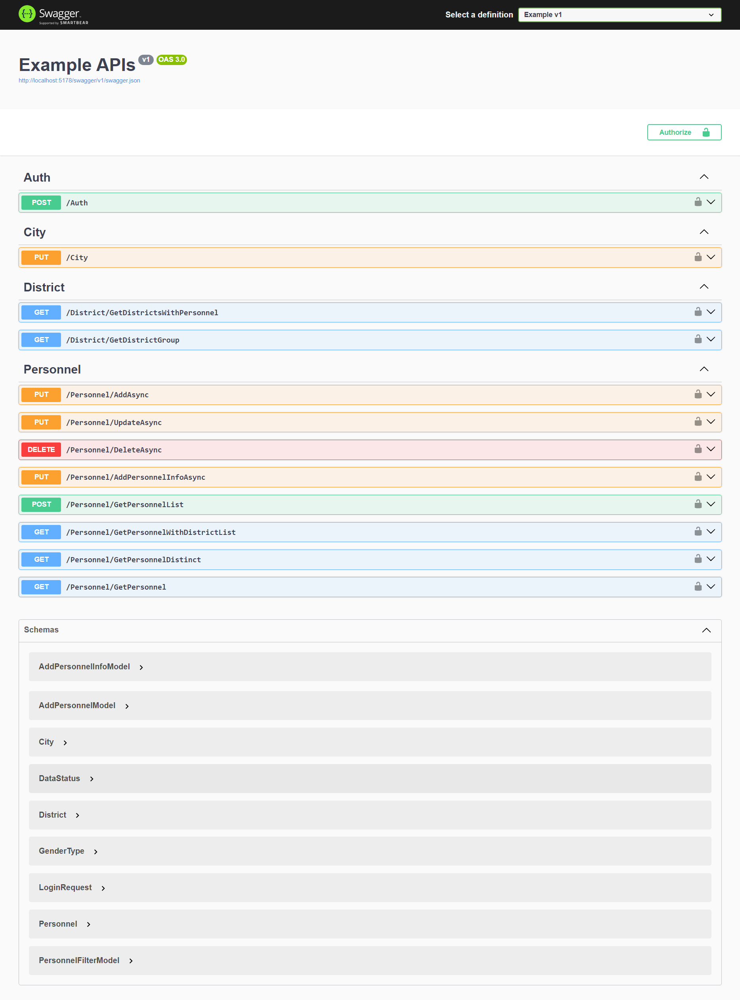

# 🎉 Building RESTful APIs with ASP.NET Core 8 🎉
This project showcases my journey of mastering modern, scalable, and maintainable Web API development using .NET 8. It is built upon the principles and best practices of professional API development.

## 🚀 Project Overview  
This repository contains a RESTful API developed with a focus on:  
- Scalability  
- Maintainability  
- Clean Code Practices  
- Real-world Implementation of Layered Architecture  

The project demonstrates the application of advanced API development techniques to create a robust and professional-grade solution.  

---

## 📌 Key Highlights  
✅ **Middleware**: Customizing and extending API functionalities to meet specific needs.  
✅ **Caching**: Boosting performance by implementing efficient data caching techniques.  
✅ **Entity Framework Core (EF Core)**: Efficiently managing database operations with EF Core.  
✅ **Error Handling & Logging**: Implementing robust error management and logging strategies to ensure smooth operations and traceability.  
✅ **Identity Management (IDM)**: Mastering user authentication and authorization for secure access control.  
✅ **Unit Testing & Mocking**: Writing and executing unit tests with mocking techniques to ensure code correctness and reliability.  
✅ **Layered Architecture**: Using a Layered Architecture approach for better separation of concerns and maintainable code.  
✅ **Dependency Injection (DI)**: Building flexible, decoupled, and testable applications by leveraging interfaces and dependency injection.  
✅ **Validation**: Validating user input to ensure correctness, security, and robustness.  
✅ **Generic Repository & Unit of Work**: Implementing these patterns to improve maintainability and reusability in data access layers.  
✅ **Error Handling Middleware**: Developing custom middleware for centralized and efficient error handling across the API.  
✅ **Docker Integration**: Containerizing applications with Docker for simplified deployment and environment management.  
✅ **Clean Code Practices**: Writing clean, maintainable, and efficient code using best practices.  
✅ **Debugging**: Developing effective debugging techniques to identify and resolve issues quickly.  

---

## 💻 Technologies Used  
- **.NET 8**  
- **Entity Framework Core**  
- **Docker**  
- **Unit Testing Frameworks**  

---

## 📂 Repository Contents
- `/Example.ApplicationLayer` - Contains application-level logic and services.  
- `/Example.Database` - Handles database configurations and migrations.  
- `/Example.DomainLayer` - Includes core domain entities and business rules.  
- `/Example.Test` - Contains unit tests for the application.  
- `/Example.ViewModel` - Manages data transfer objects (DTOs) and view models.

---

## 📸 Project Screenshot

---

### Let’s connect!  
Feel free to explore the project and contribute if you'd like to add new features or improvements. Together, let's build the future of scalable web applications! 🚀
